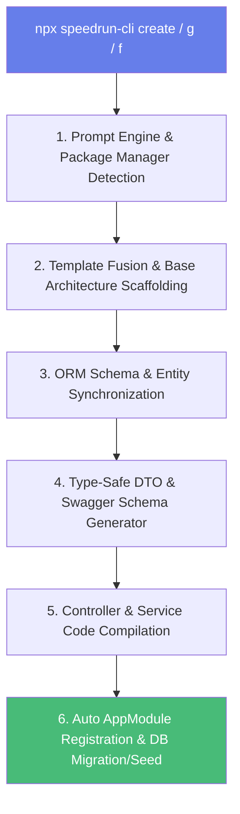

<div align="center">

# 🚀 speedrun-cli

> **📖 Looking for full interactive flows, input/output terminal sessions, and generated code examples?**  
> Check out the complete [**USAGE.md (Command & Interactive Flow Guide)**](./USAGE.md).

### The Zero-Config Way to Build Secure Authentication & CRUD APIs

**Stop wasting 40 hours building JWT auth & CRUD modules from scratch.**  
Get a battle-tested, production-ready NestJS auth system and Swagger-documented APIs in **under 3 minutes**.

[](https://www.npmjs.com/package/@astralicc/create-nestjs-auth-swagger)
[](https://www.npmjs.com/package/@astralicc/create-nestjs-auth-swagger)
[](LICENSE)
[](https://nodejs.org)
[](https://www.typescriptlang.org/)
[](https://nestjs.com/)
[](https://swagger.io/)
[](CONTRIBUTING.md)

```bash
npx speedrun-cli create my-app
```

[Quick Start](#getting-started--quick-start) | [Commands](#cli-command-quick-reference) | [Features](#core-feature-highlights) | [Usage Guide](./USAGE.md)

---

**v2.7.14** | **Interactive Module Generator** | **Field Manager** | **4 ORMs** | **4 Databases**

</div>

---

## 🌟 Core Feature Highlights

* ⚡ **Instant NestJS Boilerplate Scaffolding:** Choose your ORM (Prisma, TypeORM, Mongoose, Drizzle) and Database (PostgreSQL, MySQL, SQLite, MongoDB).
* 🔑 **Custom Primary Key Naming:** Choose between `id`, `snake_case` (`order_id`), `camelCase` (`orderId`), or custom PK formats synced seamlessly across ORM schemas, DTOs, response models, and Controller `@Param()` annotations.
* 🔤 **ORM-Native Field Types:** The field builder dynamically tailors field type options based on the detected ORM (e.g., Prisma `Int`/`Float`/`DateTime`, TypeORM `decimal`/`timestamp`, Drizzle `numeric`) and applies matching TypeScript types and `class-validator` rules.
* 🔐 **Auth & Role Guard Injection:** Protect write operations (`POST`, `PUT`, `DELETE`) automatically with pre-configured `@UseGuards(JwtAuthGuard, RolesGuard)` and `@Roles('ADMIN', 'SUPERADMIN')` decorators.
* 🔗 **Relationship Builder:** Add `Many-to-One` or `One-to-Many` relationships to other modules directly from the terminal with automatic foreign key wiring.
* ✏️ **Sub-Menu Interactive Field Manager (`speedrun-cli field` / `f`):** Modify existing generated modules on the fly. Selectively edit specific field attributes (Name, Type, or Optional status), add new fields, or delete fields with automated DTO and ORM schema re-sync.
* ⚙️ **Dynamic Module Configurator (`speedrun-cli config` / `c`):** Customize Auth Guards, change role permissions (`@Roles('ADMIN', 'SUPERADMIN')`), and enable/disable active CRUD endpoints on existing controllers without rewriting code.
* 🏗️ **Automated Base Architecture:** Ensures `src/common/base` (`BaseController`, `BaseService`, and Swagger helpers) exists to eliminate missing import compilation errors (`TS2307`/`TS4112`).
* 🔄 **Auto AppModule Registration:** Automatically injects generated modules into `src/app.module.ts`.

---

## 📌 CLI Command Quick Reference

| Command | Alias | Description |
| --- | --- | --- |
| `speedrun-cli create [app-name]` | *(default)* | Scaffolds a new production-ready NestJS Auth project. |
| `speedrun-cli generate [module]` | `g` | Generates a new CRUD module with PKs, fields, ORM sync, and Auth Guards. |
| `speedrun-cli field [module]` | `f` | Interactive Field Manager to Add, Edit (sub-menu), or Delete fields on existing modules. |
| `speedrun-cli config [module]` | `c` | Customize role guards (`@Roles`), auth protection, and active CRUD operations. |

---

## 🚀 Getting Started & Quick Start

### 1. Scaffold a New Project
```bash
# Interactive setup: choose ORM, Database, Swagger, Base CRUD & Package Manager
npx speedrun-cli create my-awesome-api

# Or use non-interactive mode with default options
npx speedrun-cli create my-awesome-api --yes
```

### 2. Generate a New CRUD Module
```bash
cd my-awesome-api

# Interactively generate a module with custom PK, fields, relations & guards
npx speedrun-cli g orders
```

### 3. Modify Fields of an Existing Module
```bash
# Manage fields: Add new field, Edit field (via sub-menu), or Delete field
npx speedrun-cli f orders
```

### 4. Configure Roles & Toggle Active Endpoints
```bash
# Customize Auth Guards, update role permissions, or enable/disable routes
npx speedrun-cli c orders
```

---

## 💡 Why This Exists

Building secure JWT authentication and standard CRUD operations from scratch usually takes **34-46 hours**. You need:
- Access tokens + refresh token rotation
- HttpOnly cookies (not localStorage)
- Multi-device session management
- Role-based access control (RBAC)
- Rate limiting & brute-force protection
- PII-safe logging
- Proper password hashing (bcrypt 12 rounds)
- Flexible ORM & database choices
- **Consistent, secure CRUD boilerplate with strict validation**
- **Automated API Documentation (Swagger)**

**`speedrun-cli` gives you all of that in under 3 minutes.**

<div align="center">

### Time Savings Matrix

| Task | From Scratch | With `speedrun-cli` |
|------|---------------|-------------------|
| Project Scaffolding & Auth | 34-46 hours | **3 minutes** |
| Module Generation & Schema Sync | 4-6 hours | **10 seconds** |
| Field Editing & Migration | 2-3 hours | **5 seconds** |

</div>

---

## ⚙️ How It Works Behind the Scenes

`speedrun-cli` isn't just a simple template copier — it's an intelligent code generation engine that dynamically compiles ORM schemas, NestJS DTOs, Controllers, and Services based on interactive inputs.



### 1. Template Fusion & Base Architecture (`src/generator.js`)
When running `create`, the CLI dynamically merges modular template layers based on your chosen ORM (`Prisma`, `TypeORM`, `Drizzle`, `Mongoose`) and Database (`PostgreSQL`, `MySQL`, `SQLite`, `MongoDB`). It automatically injects the `src/common/base` architecture containing abstract `BaseController`, `BaseService`, and Swagger response wrappers.

### 2. Custom Primary Key & ORM Schema Sync (`src/moduleGenerator.js`)
When generating a module (`speedrun-cli g [module]`), your primary key selection (`id`, `order_id`, `orderId`, etc.) is bound across the entire stack:
- **Database Layer:** Marks the custom primary key column in Prisma (`@id`), TypeORM (`@PrimaryGeneratedColumn`), Drizzle (`primaryKey()`), or Mongoose (`@Prop`).
- **Service Layer:** Binds database query filters (`where: { order_id }`) for all CRUD methods.
- **Controller Layer:** Generates route params `@Param('order_id', ParseUUIDPipe)` matching OpenAPI `@ApiParam()` documentation.

### 3. ORM-Native Type Mapping & DTO Compilation
Field types selected in the interactive prompt (`Int`, `Float`, `Decimal`, `DateTime`, `varchar`, `timestamp`, `numeric`) are automatically converted into:
- **TypeScript Types:** `string`, `number`, `boolean`, `Date`, `object`.
- **Validation Rules:** `@IsString()`, `@IsInt()`, `@IsNumber()`, `@IsBoolean()`, `@IsDate()`, `@Type(() => Date)`.
- **Swagger Documentation:** `@ApiProperty()` / `@ApiPropertyOptional()` metadata with realistic example values.

### 4. Automatic `AppModule` Injection
The CLI parses `src/app.module.ts` using static analysis, adding the new module's import statement at the top and registering it inside `@Module({ imports: [...] })` so your API routes are active instantly.

### 5. Interactive Field Manager Engine (`src/fieldManager.js`)
When managing fields on an existing module (`speedrun-cli f [module]`):
- **Parser Engine:** Reads `create-[module].dto.ts` and decodes `class-validator` decorators to accurately reconstruct existing fields and ORM types without precision loss.
- **Sub-Menu Property Editor:** Allows isolated changes to field name, field type, or optional status without touching adjacent properties.
- **Re-Sync Engine:** Updates all 3 DTOs (`create`, `update`, `response`), updates the ORM model definition in-place, and prompts to trigger immediate database migration and seeding.

---

## 🛡️ What You Get

<table>
<tr>
<td width="50%">

### Enterprise-Grade Security

- **Token Rotation** - Refresh tokens auto-rotate on use
- **Zero XSS Risk** - HttpOnly cookies only
- **Bcrypt 12 Rounds** - 2025 security baseline
- **Rate Limiting** - 5 auth attempts/min
- **PII-Safe Logs** - Passwords/tokens auto-redacted
- **Mass Assignment Protection** - `ValidationPipe` with `whitelist: true` & `forbidNonWhitelisted: true`
- **Strict Parameter Parsing** - `@ParseUUIDPipe` on ID parameters

</td>
<td width="50%">

### Developer Experience

- **Interactive Module Generator** - Scaffold CRUD in seconds
- **Sub-Menu Field Manager** - Modify fields safely anytime
- **Auto-Generated Swagger Docs** - Out-of-the-box UI at `/api/docs`
- **Base CRUD Architecture** - Abstract `BaseService` & `BaseController`
- **TypeScript** - 100% type safety across DTOs and ORM schemas
- **Prisma Studio** - Visual database UI support

</td>
</tr>
<tr>
<td width="50%">

### Production-Ready

- **RBAC in 1 Line** - `@Roles('ADMIN', 'SUPERADMIN')`
- **Multi-Device Sessions** - Track 5 devices/user
- **Structured Logging** - Pino JSON logs
- **Input Validation** - class-validator + class-transformer
- **CORS & Helmet** - Security headers included
- **Global Error Handling** - Handled `NotFoundException` & Soft-Deletes

</td>
<td width="50%">

### Flexible Database Support

- **4 ORMs** - Prisma, Drizzle, TypeORM, Mongoose
- **4 Databases** - PostgreSQL, MySQL, SQLite, MongoDB
- **Type-Safe** - Full TypeScript support across all ORMs
- **Migrations & Seeds** - Automated schema push/migration and table seeding

</td>
</tr>
</table>

---

## 🗄️ Multi-ORM & Database Matrix

```
┌─────────────┬────────────┬───────┬────────┬─────────┐
│             │ PostgreSQL │ MySQL │ SQLite │ MongoDB │
├─────────────┼────────────┼───────┼────────┼─────────┤
│ Prisma      │     ✅     │  ✅   │   ✅   │   ❌    │
│ Drizzle     │     ✅     │  ✅   │   ✅   │   ❌    │
│ TypeORM     │     ✅     │  ✅   │   ✅   │   ❌    │
│ Mongoose    │     ❌     │  ❌   │   ❌   │   ✅    │
└─────────────┴────────────┴───────┴────────┴─────────┘
```

---

## 📋 CLI Flags & Options

| Option | Description | Example |
|--------|-------------|---------|
| `g [module]` / `generate` | Generate a new CRUD module | `npx speedrun-cli g products` |
| `f [module]` / `field` | Manage fields on an existing module | `npx speedrun-cli f products` |
| `--orm <orm>` | Select ORM (prisma, drizzle, typeorm, mongoose) | `npx speedrun-cli create my-app --orm drizzle` |
| `--database <db>` | Select database (postgres, mysql, sqlite, mongodb) | `npx speedrun-cli create my-app --database mysql` |
| `--yes` | Skip all prompts, use defaults | `npx speedrun-cli create my-app --yes` |
| `--skip-install` | Skip dependency installation | `npx speedrun-cli create my-app --skip-install` |
| `--package-manager <pm>` | Force package manager (npm, pnpm, yarn, bun) | `npx speedrun-cli create my-app --package-manager pnpm` |
| `--help` | Show CLI help message | `npx speedrun-cli --help` |

---

## 📖 Full Interactive Flow & Code Output Guide

For detailed terminal walkthroughs, step-by-step interactive prompt sessions, generated code outputs, and multi-ORM schema matrices, please visit:

👉 [**USAGE.md — Command & Interactive Flow Guide**](./USAGE.md)

---

## 📄 License

**MIT License** - free to use in personal and commercial projects. See [LICENSE](LICENSE) for details.
